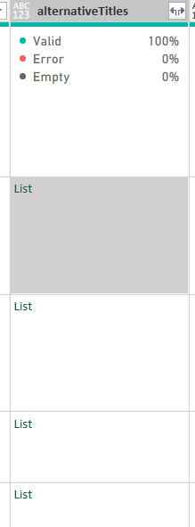

# Using rapidAPI to analyze and visualize data 

## Why is this project important? :hammer:

- Downloading files is tiring
- A data source won't always be available locally
- Getting hands on real data
- Can be extended to clean data in real time, by developing a pipeline. 

## Wanna learn how to setup the data? :rocket:

- https://github.com/ZehraArshad/Excel_Github/blob/main/API_With_PowerBI/howto/readme.md


## Data Cleaning :scissors:

Sometimes, you could end up with data like this:

</br>



- Add a custom column, use the following formula
This will extract the first item in the list.  

```
= [alternativeTitles]{0} 
```

### How to do this efficiently?

- Open a new query and in advanced editor, paste the following code 

```
let
    Source = Anime,  // Use your table name
    SelectedColumns = Table.SelectColumns(Source, {"_id", "alternativeTitles"}),
    ExpandedTable = Table.ExpandListColumn(SelectedColumns, "alternativeTitles"),
    RenamedTable = Table.RenameColumns(ExpandedTable, {{"alternativeTitles", "anime_alternate_Title"}}),
    FinalTable = Table.AddIndexColumn(RenamedTable, "id", 1, 1, Int64.Type)
in
    FinalTable

```
- This is a better data practice as now we can move to another table to search for their alternative titles. This will make data handling and analysis easier too. 

- Will do a similar task for genres too.

 - Applying these steps will eventually lead us to data modelling as we are relying on _id (id of anime) as a foreign key in genres and alternative titles. 


## Data Modelling 
