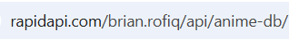
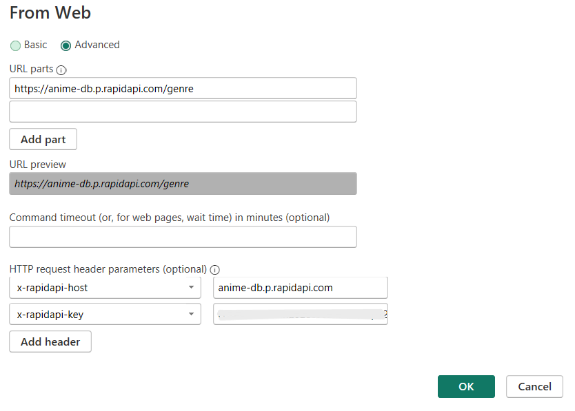

# No more downloading zips and excel
## Utilizing APIs to learn data analysis

1. Get data -> Others -> Web -> Click Connect

2. If you are using an open API, enter URL in the basic

2.  In my case, I am using rapid API and will be using anime_db API

3. On the left (rapidAPI), click on genres *thats the easiest to start with*

4. On your right (rapidAPI), you will see a url https://anime-db.p.rapidapi.com/genre

5. Copy the url and past in the powerBI

6. Similarly, you will see a host and key in the code snippets on rapidAPI, copy them one by one and paste in powerBI, make sure nothing is in QUOTATIONS

7. When you click ok, you will be prompted to a window, select anonymous. 

- You can type a new query to add more data. 

:heavy_exclamation_mark:	Getting an authorization error? Make sure, you are subscribed to rapidAPI, if you aren't, you can now by clicking "Test the endpoint" or "Subscribe". If you get 202 results, you are good to go and everything should work on trying again. 

