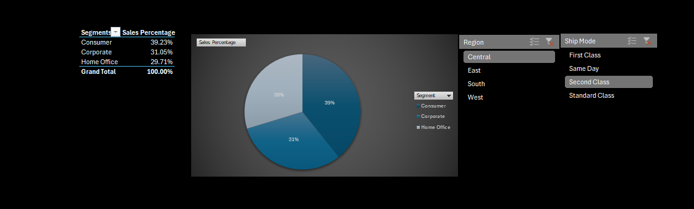

## Excel Portfolio Project

# Dataset
The dataset contained information regarding orders made at a home/office store. Following were the columns
- Row ID
- Order ID	
- Order Date	
- Ship Date	
- Ship Mode	
- Customer ID	
- Customer Name	
- Segment
- Country	
- City	
- State	
- Postal Code	
- Region	
- Product ID	
- Category	
- Sub-Category	
- Product Name	
- Sales	
- Cost	
- Qty	
- Profit

I answered the following questions using Excel by utilizing pivots, vlookup, calculated columns, filters, index matching.

1. What is the total profit for each category? 
2. What is the total profit for each sub-category?
3. What are the total sales for each product ?
4. Which city recorded the highest sales?
5. Identify the most common shipping mode used by customers? 
6. Which product has the highest sales per unit? (Divide total sales by quantity sold using a calculated column.)
7.	How many unique customers are in the dataset?
8. Customers with highest purchase order value
9.	Segment wise distribution wrt to region and ship mode.
10.	Regional distribution
11.	How many orders fall within specific sales ranges (e.g., <$100, $100-$200, $200-$300, $300-$400, $400-$500, $500-$600, $600-$700, $700-$800, $800-$900, >$1,000)?
(Use COUNTIFS to define multiple ranges.)

## Highlight: Segment Wise Distribution With Respect to Region and Shipping 

