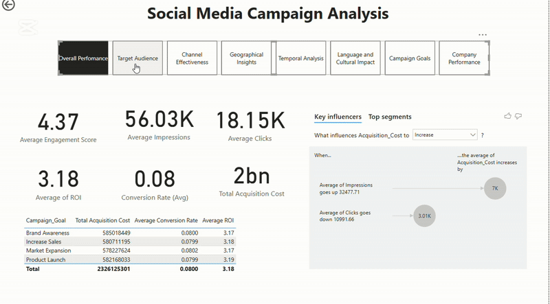

# Social Media Campaign Dashboard

##  Overview
This dataset contains **30,000 rows** of social media advertising campaign data across different platforms. It includes key metrics such as **conversion rates, engagement scores, and ROI**, making it useful for marketing analytics and performance evaluation.

## Dataset Description  
Each row represents a unique advertising campaign with details on **objectives, performance, and target audience**.

### 🔹 **Key Columns**  
- **Campaign Details**: `Campaign_ID`, `Company`, `Campaign_Goal`, `Duration`, `Date`
- **Targeting Information**: `Target_Audience`, `Customer_Segment`, `Location`, `Language`, `Channel_Used`
- **Performance Metrics**: `Clicks`, `Impressions`, `Engagement_Score`, `Conversion_Rate`, `Acquisition_Cost`, `ROI`

